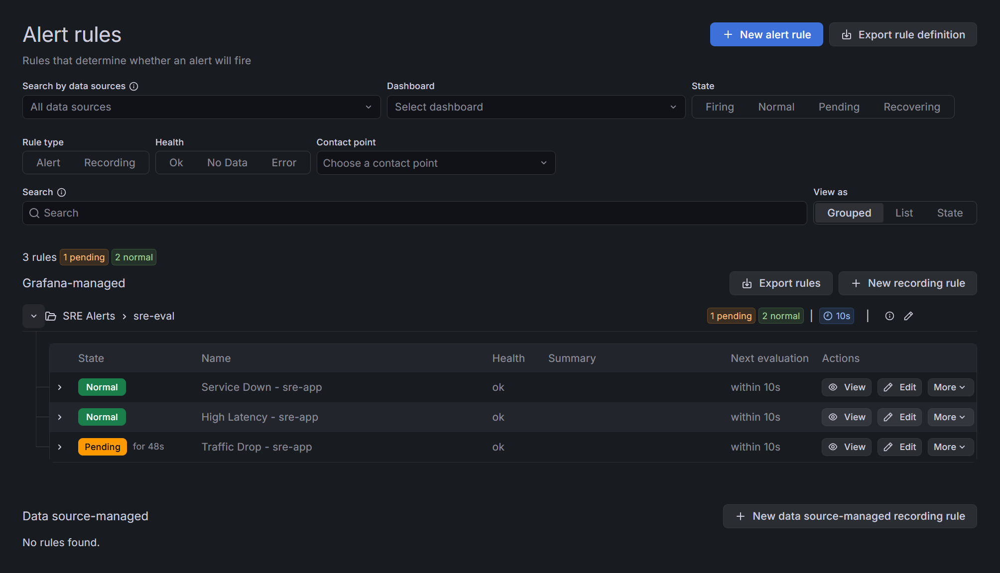

# 🚀 SRE Platform Demo

This project demonstrates how to **instrument, monitor, and visualize application health** using industry-standard observability tools.

A hands-on **Site Reliability Engineering (SRE)** demo showcasing containerization, monitoring, observability, alerting, and CI/CD using Python, Docker, Prometheus, and Grafana.

---

## 📊 Monitoring Dashboard

### Grafana Dashboard


### Prometheus Targets


### Metrics Endpoint


---

## 🚨 Alerting

The system includes alerting rules configured in Grafana to detect service health issues in real time.

* Service downtime detection
* High latency detection
* Traffic drop detection



---

## 📁 Dashboard Configuration

Grafana dashboard export is available at:

```text
monitoring/grafana/sre-dashboard.json
```

This can be imported directly into Grafana to recreate the dashboard.

---

## 🧠 Overview

This project simulates a production-style service and demonstrates core SRE concepts:

* Application instrumentation with Prometheus metrics
* Real-time monitoring using Grafana dashboards
* Alerting based on service health conditions
* Containerized services with Docker Compose
* CI/CD pipeline using GitHub Actions
* Core service reliability signals (SLIs): traffic, latency, and availability

---

## ⚙️ Tech Stack

* Python (Flask)
* Docker & Docker Compose
* Prometheus
* Grafana
* GitHub Actions (CI/CD)

---

## 🔌 Application Endpoints

| Endpoint   | Description                 |
| ---------- | --------------------------- |
| `/`        | Main application route      |
| `/health`  | Health check endpoint       |
| `/metrics` | Prometheus metrics endpoint |
| `/error`   | Simulated error endpoint    |

---

## 📈 Metrics Collected

* Request Volume
* Request Rate (requests/sec)
* Latency (average & P95)
* Service Availability (uptime)

---

## 🚀 Getting Started

### 1. Clone the repository

```bash
git clone https://github.com/Holidazee/sre-platform-demo.git
cd sre-platform-demo
```

### 2. Start the services

```bash
docker-compose up --build
```

---

## 🌐 Access Services

* App: http://localhost:5000
* Prometheus: http://localhost:9090
* Grafana: http://localhost:3000

---

## 🧪 Testing the System

Generate traffic:

```bash
curl http://localhost:5000
```

Simulate errors:

```bash
curl http://localhost:5000/error
```

---

## 🔁 CI/CD

This project includes a GitHub Actions pipeline that:

* Runs tests
* Lints code
* Builds the application

---

## 📌 Key SRE Concepts Demonstrated

* Observability (metrics collection & visualization)
* Monitoring (Prometheus + Grafana)
* Alerting (latency, downtime, traffic conditions)
* Service Level Indicators (SLIs)
* Containerized environments
* Automated workflows (CI/CD)

---

## 🔮 Future Enhancements

* Distributed tracing
* Logging integration (ELK or Loki)
* Kubernetes deployment

---

## 👨‍💻 Author

Built as a hands-on SRE/DevOps portfolio project.

