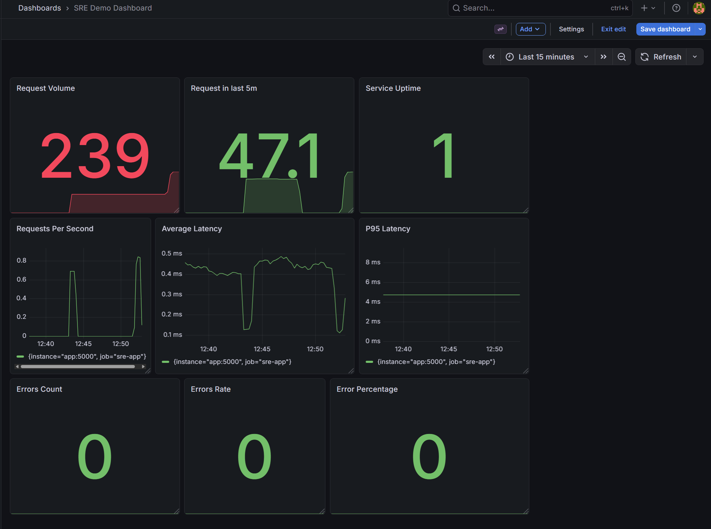
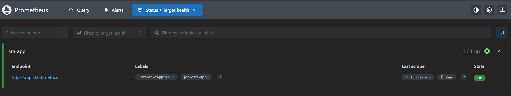
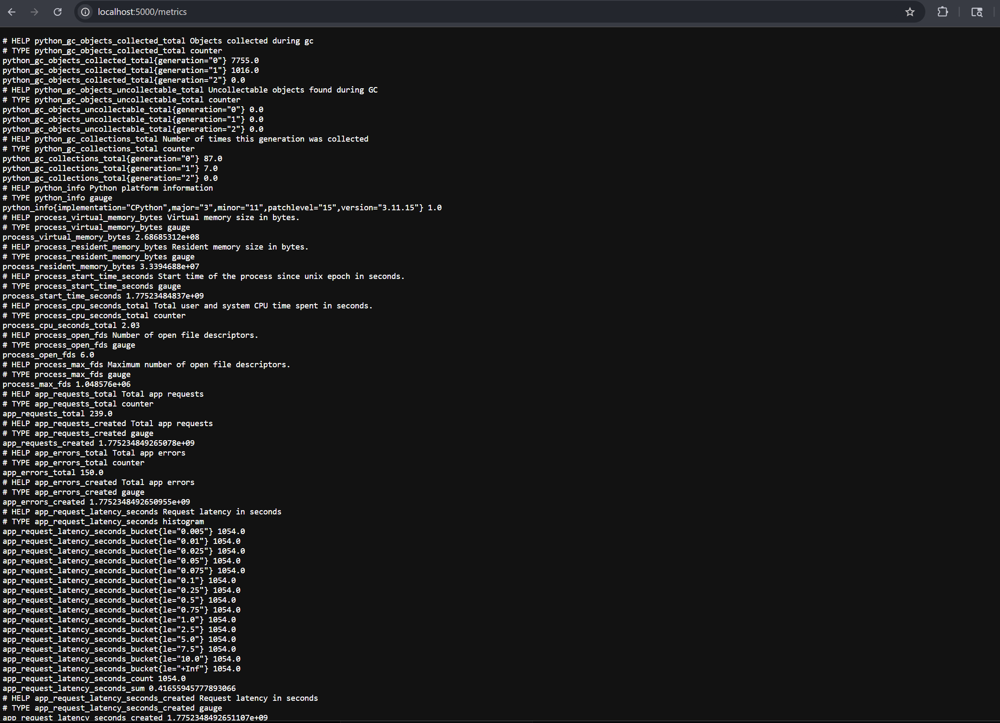

# SRE Platform Demo

A production-style SRE demo project showcasing containerization, observability, and service reliability concepts using Python, Docker, Prometheus, CI/CD and Grafana.

---

## Overview

This project simulates a real-world service environment by combining a containerized application with a full monitoring stack. It demonstrates core Site Reliability Engineering (SRE) principles including health checks, logging, metrics collection, and failure simulation.

---

## Tech Stack

* **Python (Flask)** — lightweight web service
* **Docker & Docker Compose** — containerization and orchestration
* **Prometheus** — metrics collection and scraping
* **Grafana** — data visualization and dashboards

---

## Features

* ✅ Containerized microservice
* ✅ Health check endpoint (`/health`)
* ✅ Error simulation endpoint (`/error`)
* ✅ Metrics endpoint (`/metrics`)
* ✅ Request counting and latency tracking
* ✅ Prometheus scraping configuration
* ✅ Grafana integration for visualization

---

## Service Endpoints

| Endpoint   | Description                              |
| ---------- | ---------------------------------------- |
| `/`        | Main service endpoint                    |
| `/health`  | Health check for uptime monitoring       |
| `/error`   | Simulated failure endpoint (returns 500) |
| `/metrics` | Prometheus metrics endpoint              |

---

## Observability Stack

* **Prometheus** scrapes application metrics every 5 seconds
* **Grafana** provides dashboards for monitoring:

  * Request volume
  * Error rates
  * Latency trends

---

## Getting Started

### 1. Clone the Repository

```bash
git clone https://github.com/Holidazee/sre-platform-demo.git
cd sre-platform-demo
```

### 2. Run the Stack

```bash
docker compose up --build
```

---

## Access Services

* **Application:** http://localhost:5000
* **Prometheus:** http://localhost:9090
* **Grafana:** http://localhost:3000

Grafana default login:

```
username: admin
password: admin
```

---

## Testing the System

Generate traffic:

* Visit `/` for normal requests
* Visit `/health` for health checks
* Visit `/error` to simulate failures

Then view metrics in:

* Prometheus queries
* Grafana dashboards

---

## SRE Concepts Demonstrated

* Service health monitoring
* Observability and metrics instrumentation
* Failure simulation and error tracking
* Containerized deployment
* System visibility through dashboards

---

## Future Improvements

* CI/CD pipeline (GitHub Actions)
* Alerting (Prometheus Alertmanager)
* Kubernetes deployment
* Distributed tracing

---

## Author

Taylor Burris

---

## Notes

This project is designed to demonstrate practical SRE skills and serve as a foundation for more advanced infrastructure and reliability engineering concepts.

## 📊 Monitoring Dashboard

### Grafana Dashboard


### Prometheus Targets


### Metrics Endpoint

